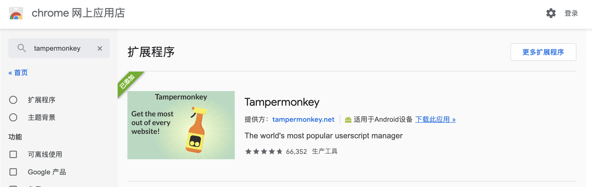
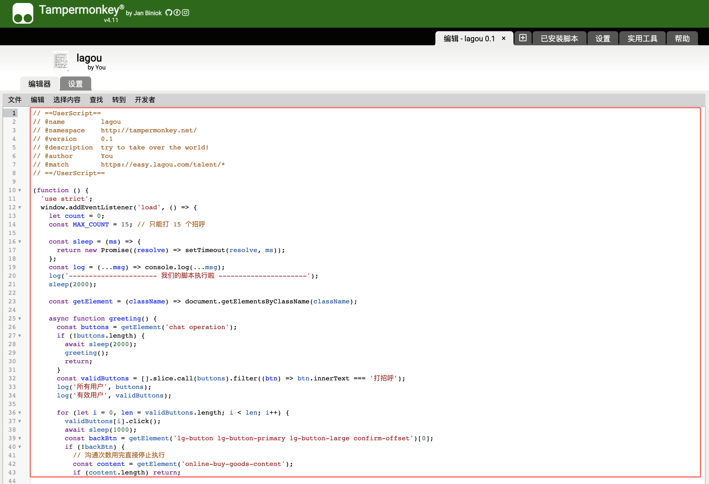

# lagou-greeting-script
一个可以在 [网页版拉勾](https://easy.lagou.com/talent/index.htm) 中自动打招呼、邀请投递简历的浏览器脚本。

# 谁可以用？
拉勾企业版白嫖用户。目前拉勾的政策是每天可以白嫖 15 次打招呼的机会。不论你是冲业绩的 HR 同学，还是想要为团队拉新的 leader，抑或只是~~想靠内推致富~~忧心团队发展想要贡献一份力量的人民群众，你都可以用到。

# 怎么用？
首先你得有一个拉勾企业版账号，发布一份职位。

获得入场券之后，你需要：
1. 下载一个浏览器扩展用来运行我们的脚本，大名鼎鼎的油猴 [Tampermonkey](https://chrome.google.com/webstore/detail/tampermonkey
/dhdgffkkebhmkfjojejmpbldmpobfkfo?hl=zh-CN)。里面还有很多针对不同网站的脚本工具，有兴趣可以淘淘看，高级玩家还可以用它来定制网站。

2. 添加扩展程序后，找到新建脚本的地方，将本项目脚本粘贴到编辑区域，Ctrl + s 保存即可。

3. 打开拉勾，就可以自动打招呼了。
